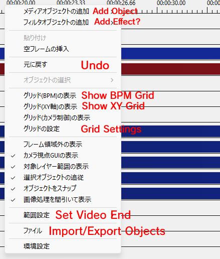
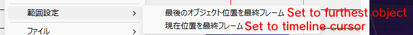
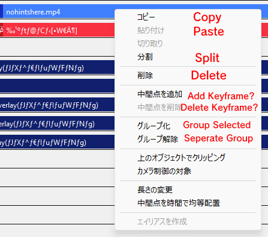
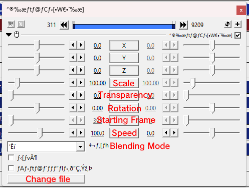
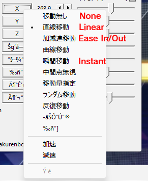

# AviUtl Reference
Picture guide of what does what in AviUtl, primarily the Extended Editor. If anything is missing, that means I haven't tested it or have no idea what it does even after testing.
## Timeline Right Click

### Set Video End

## Object Right Click

## Object Double Click

### Easing?
