# PJSekai-Overlay English Guide

This is a guide on how to use [pjsekai-overlay](https://github.com/sevenc-nanashi/pjsekai-overlay) in English. This also includes how to navigate AviUtl, but only the *bare minimum* required for this purpose.

**DISCLAIMER:**\
I do **NOT** speak Japanese. I figured out everything by trial and error. Some parts of this guide *may be partially or completely wrong*.\
Nanashi. (author of pjsekai-overlay) have stated time and time again that they **WILL NOT** help English users. This and AviUtl are tools intended for Japanese-speaking people. If problem arises, **DO NOT** ask Nanashi. for help. Instead, open an issue here or contact me on Discord (khronophobia). I'll try to help when I can.

## Prerequisites
Make sure to have the following before following this guide.
1. A 720p mp4 recording of a Chart Cyanvas/Potato Leaves chart with Hide UI enabled
2. Basic knowledge of video editors (not necessarily AviUtl)
3. Determination to make this work

I won't tell you how to obtain all of the above. You're on your own for this one.

## Instructions
### Part 1: Installation
1. Download [AviUtl v1.10](https://spring-fragrance.mints.ne.jp/aviutl/aviutl110.zip) and extract it somewhere
2. Download [patch.aul](https://github.com/ePi5131/patch.aul/releases/tag/r42) and [English Patch](https://github.com/sykhro/aviutl-english-patch/releases/latest) and extract it in the same location
3. Download [easymp4](https://aoytsk.blog.jp/aviutl/easymp4.zip) and extract it to `plugins` (Create the folder if it's not available)
4. Download [Extended Editor](https://spring-fragrance.mints.ne.jp/aviutl/exedit92.zip) and [L-SMASH-Works](https://github.com/Mr-Ojii/L-SMASH-Works-Auto-Builds/releases/download/build-2023-10-21-01-00-53/L-SMASH-Works_r1103_Mr-Ojii_Mr-Ojii_AviUtl.zip) and extract it to `plugins`
5. Download `unmult.anm` and `unmult_core.dll` from [here](https://github.com/sevenc-nanashi/unmult.anm/releases/latest).
6. Inside `plugins`, create a folder named `script` (if not already available) and move `unmult.anm` and `unmult_core.dll` inside
7. Your AviUtl folder should look like this:\
  **Base folder**\
   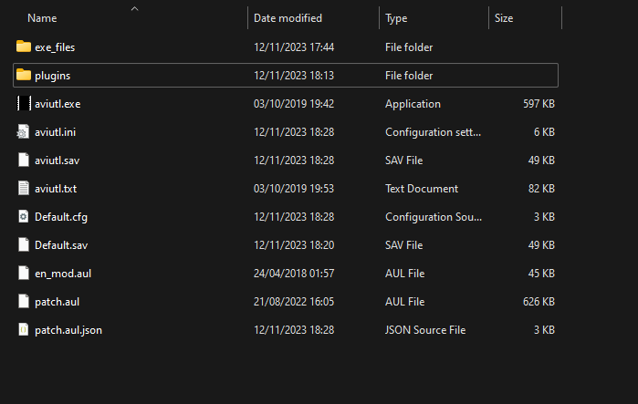\
   **Plugins folder**\
   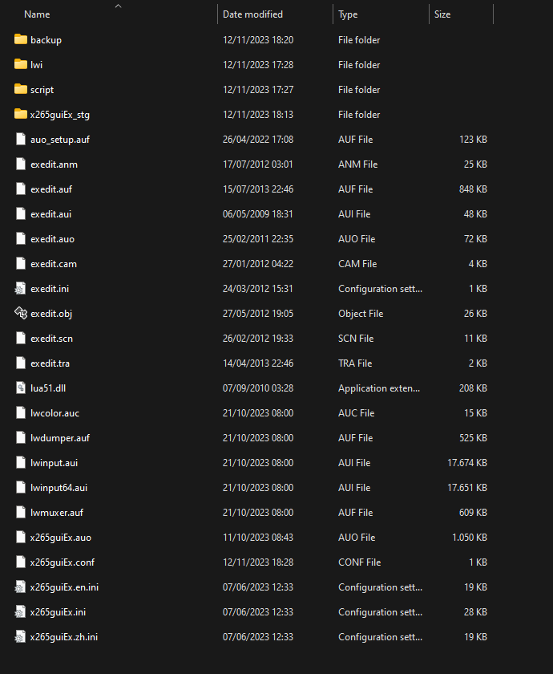
8. Download [pjsekai-overlay](https://github.com/sevenc-nanashi/pjsekai-overlay/releases/latest) and extract it anywhere
9. Launch AviUtl and take note of the language. If it's in English, skip the next step
10. Click on the first tab at the top. Hover over the 2nd option from the bottom and select the option with Language in it. Change it to English and restart AviUtl\
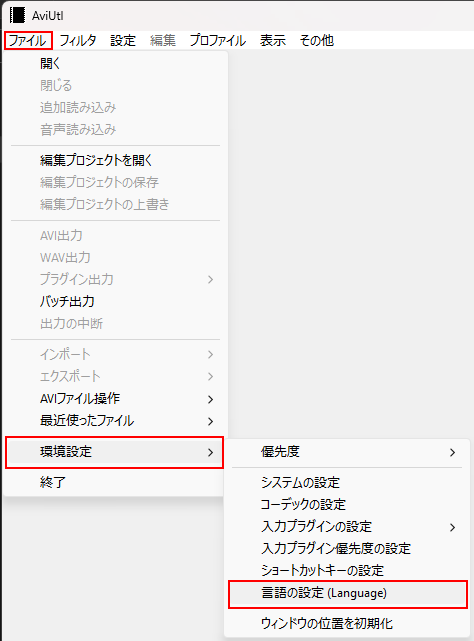\
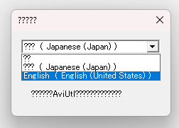

### Part 2: Setting Up a Project
**NOTE:** From this point on, some images may have text containing weird symbols. I'm not sure why, but I suspect it's because my system language isn't set to Japanese. This may or may not be the case for you.
1. Make sure that AviUtl is still open, then launch pjsekai-overlay
2. On this screen, type the id of the chart you recorded like shown. Add `chcy-` if it's a Chart Cyanvas chart, or `ptlv-` if it's a Potato Leaves chart\
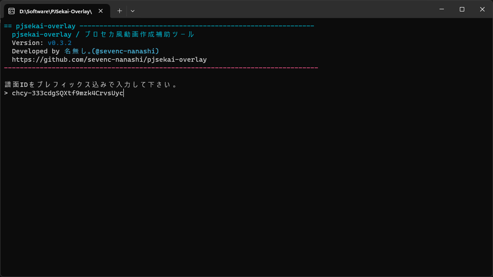
3. On this screen, type your team talent (used for calculating score). In general, 250000+ is an S rank\
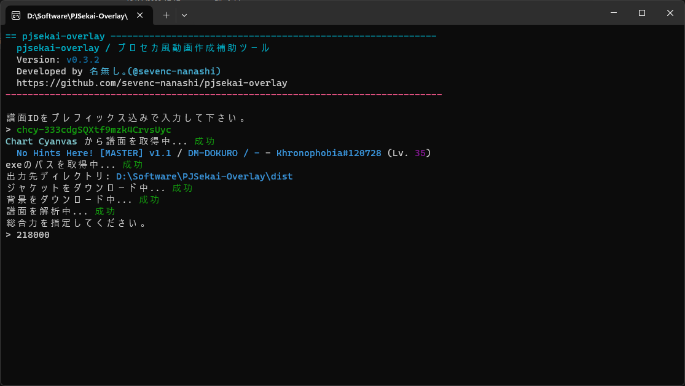
4. This screen tells you whether to enable the AP indicator. Type Y for yes and N for no\
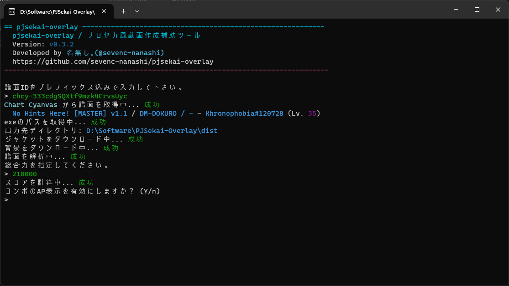
5. (Skip this step if you're on pjsekai-overlay v0.3.3 and above)\
In the AviUtl directory, there should be a folder named `script` containing `@pjsekai-overlay.obj`. It's in the wrong spot. Move it inside `plugins`
6. Go back to AviUtl and to the `Filters+` tab and click on the option below `Advanced color correction...` (highlighted in red). This will open the Extended Editor\
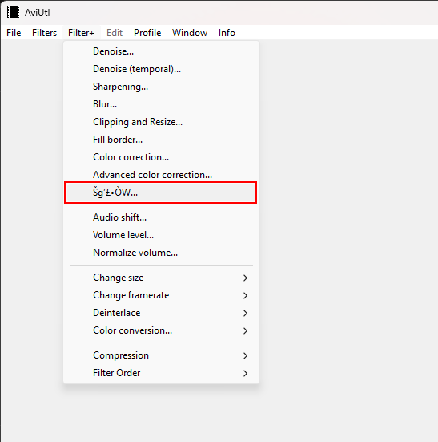
7. On the new window, right click on the timeline and click the first option (highlighted in red). This will create a new project. Set the resolution to 1280x720 and FPS to 60\
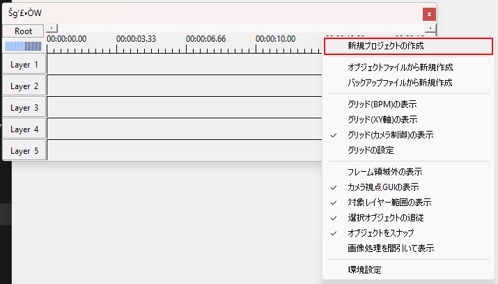
8. Right click on the timeline once again and select the option highlighted below\
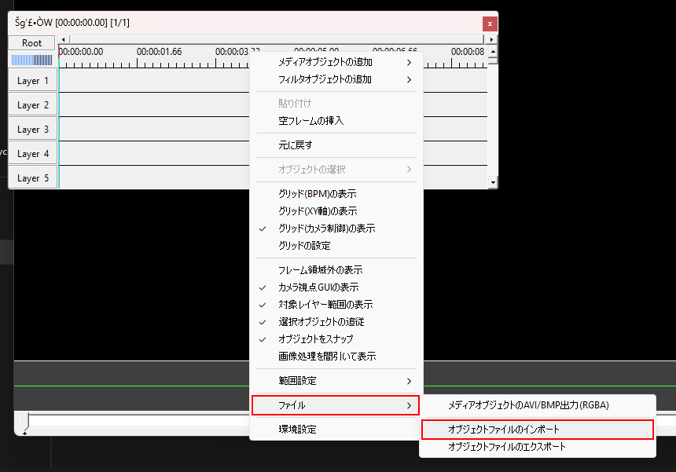
9. A file explorer window should pop up. Navigate to your pjsekai-overlay directory, and then dist/[chart id] and select `main.exo`

### Part 3: Editing
This is where the fun part starts. Refer to [this](AviUtl-Reference.md) if you ever get confused. If you have experience with video editors of any kind, this section should be significantly easier.

Something like this should pop up after you imported `main.exo`. I added red text to label what is what.\
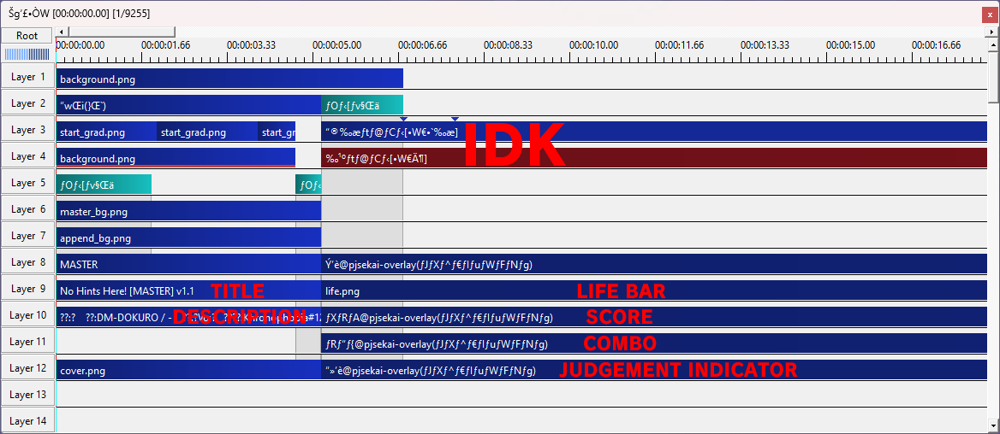

Double click on the object I labeled `VIDEO` and change it to the video you recorded. Set 'X' to '0' and 'Scale' to '100'.

Depending on the chart, the video and UI might stop early or keep going even if the chart already ended. If this is the case, resize the objects highlighted in red and drag the objects highlighted in green until it matches the end of the video. Be sure to drag the end keyframe (blue arrow) on the video as well.\
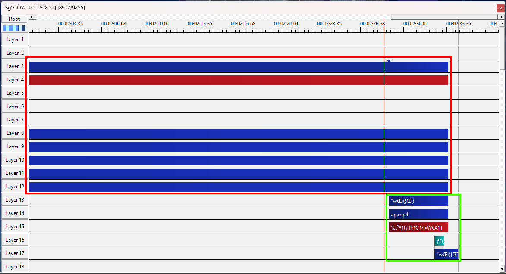

Make any modifications as needed. Once everything is satisfactory, move on to Part 4.

### Part 4: Exporting
1. To ensure that the exported video doesn't end too short or goes on for too long, right click on the timeline and set the video end to the furthest object
2. Click on File in the AviUtl window and select either `Export with AVI`, or hover over `Export with Plugin` and select the highlighted option (with MP4 in the name). Everything from then on should (hopefully) be straightforward.\
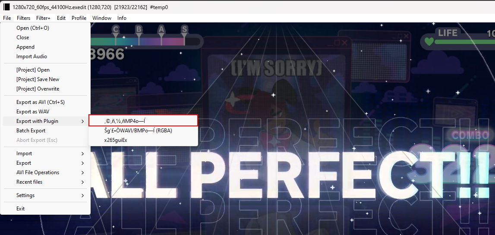

## Problems and Answers
### The fonts looks off/incorrect
Project Sekai uses `FOT-ロダンNTLG Pro EB` and `FOT-ロダンNTLG Pro DB` as its fonts. If you don't have it installed on your system, AviUtl will use another font. Find the correct fonts on Google.
