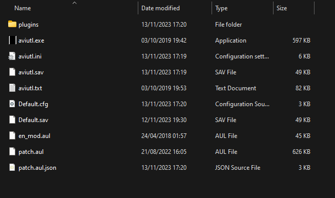

# PJSekai-Overlay English Guide (UNFINISHED!!!)

This is a guide on how to use [pjsekai-overlay](https://github.com/sevenc-nanashi/pjsekai-overlay) for English people. This also includes how to navigate AviUtl, but only the bare minimum required for this purpose.

**DISCLAIMER:**\
I do **NOT** speak Japanese. I figured out everything by trial and error. Some parts of this guide *may be partially or completely wrong*.\
As Nanashi said, this is a tool intended for Japanese people. If you're having trouble, do **NOT** ask Nanashi for help.

## Requirements
1. [pjsekai-overlay](https://github.com/sevenc-nanashi/pjsekai-overlay)
2. [AviUtl v1.10 + Extended Editor (exedit) v0.92](http://spring-fragrance.mints.ne.jp/aviutl/)
3. [patch.aul](https://github.com/ePi5131/patch.aul/releases/tag/r42)
4. [L-SMASH-Works](https://github.com/Mr-Ojii/L-SMASH-Works-Auto-Builds/releases/download/build-2023-10-21-01-00-53/L-SMASH-Works_r1103_Mr-Ojii_Mr-Ojii_AviUtl.zip)
5. [x265guiEx](https://github.com/rigaya/x265guiEx/releases/latest) (optional but recommended)
6. [English Patch](https://github.com/sykhro/aviutl-english-patch/releases/latest)
7. A 720p mp4 recording of a Chart Cyanvas/Potato Leaves chart with Hide UI enabled
8. Basic knowledge of video editors (not necessarily AviUtl)

## Instructions
### Section One: Installation
1. Download AviUtl from the link above and extract it somewhere
2. Download patch.aul and English Patch and extract it in the same location
3. Download x265guiEx and extract it in the same location
4. Download Extended Editor and L-SMASH-Works and extract it to `plugins`
5. Your AviUtl folder should look like this:\
  **Base folder**\
   \
   **Plugins folder**\
   
6. Download pjsekai-overlay and extract it anywhere
### Section Two: Usage
**NOTE:** This section contains some texts that look like weird symbols. I'm not sure why, but I suspect it's because my system language isn't set to Japanese. This may or may not be the case for you.
1. Launch AviUtl
2. Launch pjsekai-overlay
3. On this screen, type the id of the chart you recorded like shown. Add `chcy-` if it's a Chart Cyanvas chart, or `ptlv-` if it's a Potato Leaves chart\

4. On this screen, type your team talent (used for calculating score). In general, 220000+ is an S rank\

5. This screen tells you whether to enable the AP indicator. Type Y for yes and N for no\

6. Once it closes, go to your AviUtl directory. There should be a new folder named `scripts` there. For some reason, it's in the wrong spot. Move the folder inside `plugins`
7. On AviUtl, go to the `Filters+` tab and click on the option below `Advanced color correction...` (highlighted in red). This will open the Extended Editor\

8. On the new window, right click on the timeline and click the first option (highlighted in red). This will create a new project. Set the resolution to 1280x720 and FPS to 60\

9. Right click on the timeline once again and select the option highlighted below\

10. A file explorer window should pop up. Navigate to your pjsekai-overlay directory, dist, the chart id, and select `main.exo`
