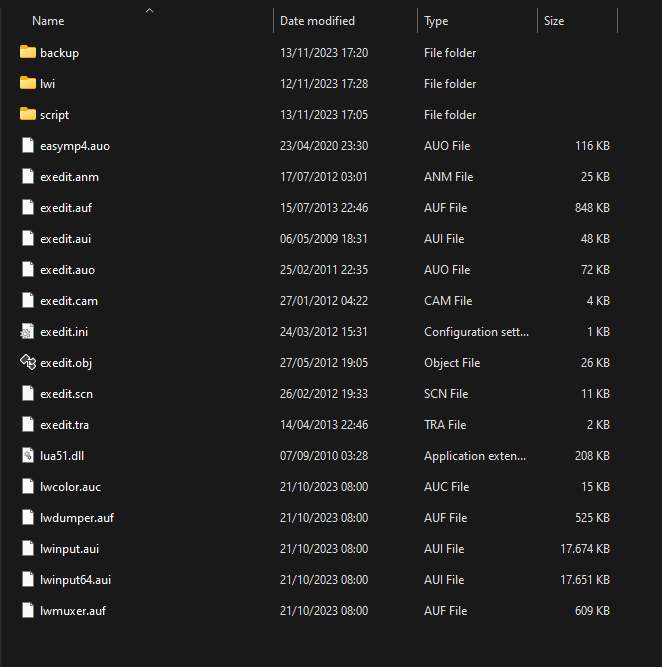
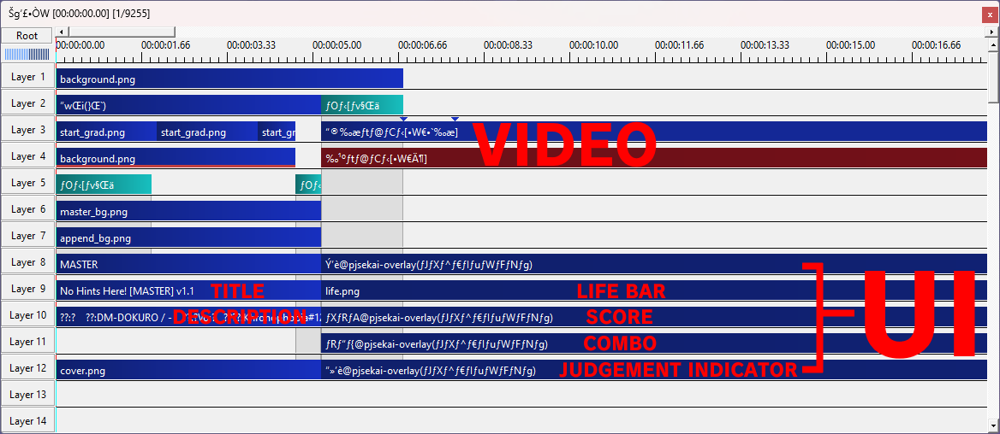

# PJSekai-Overlay English Guide

This is a guide on how to use [pjsekai-overlay](https://github.com/sevenc-nanashi/pjsekai-overlay) for English people. This also includes how to navigate AviUtl, but only the *bare minimum* required for this purpose.

**DISCLAIMER:**\
I do **NOT** speak Japanese. I figured out everything by trial and error. Some parts of this guide *may be partially or completely wrong*.\
Nanashi. (author of pjsekai-overlay) have stated time and time again that they **WILL NOT** help for English users. This and AviUtl are tools intended for Japanese-speaking people. If problem arises, **DO NOT** ask Nanashi. for help.

## Requirements
1. [pjsekai-overlay](https://github.com/sevenc-nanashi/pjsekai-overlay)
2. [AviUtl v1.10 + Extended Editor (exedit) v0.92](http://spring-fragrance.mints.ne.jp/aviutl/)
3. [patch.aul](https://github.com/ePi5131/patch.aul/releases/tag/r42)
4. [L-SMASH-Works](https://github.com/Mr-Ojii/L-SMASH-Works-Auto-Builds/releases/download/build-2023-10-21-01-00-53/L-SMASH-Works_r1103_Mr-Ojii_Mr-Ojii_AviUtl.zip)
5. [easymp4](https://aoytsk.blog.jp/aviutl/easymp4.zip)
6. [English Patch](https://github.com/sykhro/aviutl-english-patch/releases/latest)
7. [unmult.anm](https://github.com/sevenc-nanashi/unmult.anm/releases/latest)
8. A 720p mp4 recording of a Chart Cyanvas/Potato Leaves chart with Hide UI enabled
9. Basic knowledge of video editors (not necessarily AviUtl)

## Instructions
### Section One: Installation
1. Download AviUtl from the link above and extract it somewhere
2. Download patch.aul and English Patch and extract it in the same location
3. Download easymp4 and extract it to `plugins` (Create the folder if it's not available)
4. Download Extended Editor and L-SMASH-Works and extract it to `plugins`
5. Inside `plugins`, create a folder named `scripts` (if not already available) and move `unmult.anm` and `unmult_core.dll` inside
6. Your AviUtl folder should look like this:\
  **Base folder**\
   \
   **Plugins folder**\
   
7. Download pjsekai-overlay and extract it anywhere
### Section Two: Setting Up a Project
**NOTE:** From this point on, some images may have text containing weird symbols. I'm not sure why, but I suspect it's because my system language isn't set to Japanese. This may or may not be the case for you.
1. Launch AviUtl
2. Launch pjsekai-overlay
3. On this screen, type the id of the chart you recorded like shown. Add `chcy-` if it's a Chart Cyanvas chart, or `ptlv-` if it's a Potato Leaves chart\

4. On this screen, type your team talent (used for calculating score). In general, 220000+ is an S rank\

5. This screen tells you whether to enable the AP indicator. Type Y for yes and N for no\

6. Once it closes, go to your AviUtl directory. There should be a new folder named `scripts` there. For some reason, it's in the wrong spot. Move the folder inside `plugins`
7. On AviUtl, go to the `Filters+` tab and click on the option below `Advanced color correction...` (highlighted in red). This will open the Extended Editor\

8. On the new window, right click on the timeline and click the first option (highlighted in red). This will create a new project. Set the resolution to 1280x720 and FPS to 60\

9. Right click on the timeline once again and select the option highlighted below\

10. A file explorer window should pop up. Navigate to your pjsekai-overlay directory, and then dist/[chart id] and select `main.exo`
### Section Three: Editing
If you have experience with video editors of any kind, this section will be significantly easier. Something like this should pop up after you imported `main.exo`. I added red text to label what is what.\

When you right-click on one of them (from now on, I'll refer to them as clips) a menu will appear. This is what most of them do:\
\
(Anything I haven't labeled means I haven't tested or have no clue what it does)

Double clicking on a clip will open a window where you can modify them.

Right clicking on the timeline will open a menu. This is what some of them do:\

On the original AviUtl window, you should see the PJSekai UI appear like this:\
\
Add your recorded video by dragging it into the Extended Editor window. Put it in Layer 5 or so. Make sure to line up the video with the combo.

Depending on the chart, the UI might stop early (or keep going even if the chart already ended). In this case resize the clips highlighted in red and drag the clips highlighted in green to match the recorded video. (I'm not sure about the one highlighted in purple. In my testing I find that it does nothing.)\

Once everything is satisfactory, click on File in the AviUtl window and select either `Export with AVI`, or hover over `Export with Plugin` and select the highlighted option (with MP4 in the name). Everything from then on should (hopefully) be straightforward.\

## Problems and Answers
### The fonts looks off/incorrect
Project Sekai uses `FOT-ロダンNTLG Pro EB` and `FOT-ロダンNTLG Pro DB` as its fonts. If you don't have it installed on your system, AviUtl will use another font. Find the correct fonts on Google.
### The video ends too early/goes on for too long
Right click on the timeline and refer to [Section Three.](#section-three-editing)
